# OpenTAP 9.33.0 执行框架架构分析

> 基于 E:\SourceCode\opentap-9.33.0 源码分析  
> 目的：为 EonTest 架构设计提供参考

---

## 目录

1. [整体架构概览](#1-整体架构概览)
2. [TestPlan 执行引擎](#2-testplan-执行引擎)
3. [TestStep 执行生命周期](#3-teststep-执行生命周期)
4. [资源管理体系](#4-资源管理体系)
5. [并行执行模型](#5-并行执行模型)
6. [日志系统](#6-日志系统)
7. [结果收集与通知](#7-结果收集与通知)
8. [CLI 入口](#8-cli-入口)
9. [Verdict 与 Break 机制](#9-verdict-与-break-机制)
10. [整体执行流程图](#10-整体执行流程图)

---

## 1. 整体架构概览

### 1.1 核心抽象层次

```
┌────────────────────────────────────────┐
│            TestPlan                     │
│  (Engine/TestPlan.cs)                   │
│  包含: List<ITestStep> Steps            │
│         List<IResultListener> Listeners │
│         ResourceManager                 │
└────────────┬───────────────────────────┘
             │ Execute()
             ▼
┌────────────────────────────────────────┐
│         TestPlanExecution              │
│  (Engine/TestPlanExecution.cs)         │
│  阶段: Open → Execute → Close          │
│  管理: 资源生命周期、步骤循环、结果收集 │
└────────────┬───────────────────────────┘
             │ DoRun()
             ▼
┌────────────────────────────────────────┐
│            TestStep                    │
│  (Engine/TestStep.cs)                  │
│  每个步骤: Run() → 测试逻辑            │
│  可包含: 子步骤 (Sequence/Parallel)    │
└────────────────────────────────────────┘
```

### 1.2 关键类型关系

```
ITapPlugin (标记接口)
  ├── IResource
  │   ├── IInstrument  → Instrument  (Engine/Instrument.cs)
  │   ├── IDut         → Dut         (Engine/Dut.cs)
  │   └── IResultListener → ResultListener (Engine/ResultListener.cs)
  ├── ITestStep        → TestStep    (Engine/TestStep.cs)
  └── ITestPlan        → TestPlan    (Engine/TestPlan.cs)
```

---

## 2. TestPlan 执行引擎

### 2.1 入口方法

**同步入口** `Engine/TestPlanExecution.cs:537-541`：

```csharp
public TestPlanRun Execute()
{
    return Execute(ResultSettings.Current, null);
}

public TestPlanRun Execute(
    IEnumerable<IResultListener> resultListeners,
    IEnumerable<ResultParameter> metaDataParameters = null,
    HashSet<ITestStep> stepsOverride = null)
{
    return executeInContext(resultListeners, metaDataParameters, stepsOverride);
}
```

**异步入口** `Engine/TestPlanExecution.cs:492-510`：

```csharp
public Task<TestPlanRun> ExecuteAsync(
    IEnumerable<IResultListener> resultListeners,
    IEnumerable<ResultParameter> metaDataParameters,
    HashSet<ITestStep> stepsOverride,
    CancellationToken cancellationToken)
{
    var tcs = new TaskCompletionSource<TestPlanRun>();
    TapThread.Start(() => {
        cancellationToken.Register(TapThread.Current.Abort);
        var testPlanRun = Execute(resultListeners, metaDataParameters, stepsOverride);
        tcs.SetResult(testPlanRun);
    }, "Plan Thread");
    return tcs.Task;
}
```

异步版本将同步 `Execute()` 包装在 `TapThread` 专用线程中。

### 2.2 核心方法 `DoExecute()` 流程

`Engine/TestPlanExecution.cs:554-854` — 17 个阶段：

```
DoExecute()
│
├─① 初始化
│   ├── 验证 resultListeners 非空
│   ├── 加载 ResultParameters 缓存
│   ├── 可选地添加 summaryListener
│   ├── 过滤已禁用的 result listeners
│   └── 处理 stepsOverride：展开层级，验证无父子冲突
│
├─② 创建日志流
│   ├── 创建 HybridStream (内存+文件)
│   ├── 创建 FileTraceListener 绑定流
│   └── 注册到 Log.AddListener()
│
├─③ 展平步骤
│   ├── 展开所有步骤 → allSteps, allEnabledSteps
│   ├── 发现 IResultSink → 创建 ResultSinkListener
│   └── 重置所有步骤 Verdict = NotSet
│
├─④ 创建 TestPlanRun
│   ├── 首次: new TestPlanRun(this, listeners, time, stamp)
│   ├── 续跑: new TestPlanRun(currentExecutionState, time, stamp)
│   └── execStage.Start() → 初始化 ResourceManager
│
├─⑤ 打开资源 (OpenInternal)
│   ├── run.ResourceManager.EnabledSteps = allEnabledSteps
│   ├── run.ResourceManager.StaticResources = listeners + additional
│   ├── run.ResourceManager.BeginStep(Open stage)
│   └── 异步打开所有资源
│
├─⑥ PrePlanRun (递归)
│   ├── RunPrePlanRunMethods(steps)
│   ├── 每个 enabled step: step.PrePlanRun()
│   └── ResourceManager 中注册 BeginStep/EndStep
│
├─⑦ 执行测试步骤 (ExecTestPlan)
│   ├── 等待所有资源打开完成
│   ├── 调用 OnTestPlanRunStart(listeners)
│   ├── 调用 TestPlanPreRunEvent mixins
│   ├── 主循环: for steps[] → step.DoRun()
│   └── 处理 Break/SuggestedNextStep
│
└─⑧ 清理 (finally)
    ├── finishTestPlanRun()
    ├── PostPlanRun (逆序)
    ├── OnTestPlanRunCompleted(listeners)
    ├── 关闭所有资源 (EndStep Open/Execute)
    └── 移除日志 listener
```

### 2.3 `stepsOverride` 机制

`stepsOverride` (`HashSet<ITestStep>`) 用于执行测试计划的子集：

- 排除父子冲突（不能同时包含步骤及其父步骤）
- 用 `Utils.FlattenHeirarchy` 展开层级
- 仅匹配 override 集合中的步骤
- 记录 `StepOverrideList` 参数

> **重要**：`stepsOverride` 仅过滤**哪些步骤被执行**，不影响资源发现。被排除步骤引用的 DUT/仪器可能仍会被打开。

---

## 3. TestStep 执行生命周期

### 3.1 `DoRun()` 扩展方法

`Engine/TestStep.cs:905-1085` (`TestStepExtensions` 静态类)：

```
DoRun(Step, planRun, parentRun, attachedParameters)
│
├─① 准备
│   ├── 等待前一次 StepRun 完成
│   ├── 设置 Step.PlanRun = planRun
│   ├── 重置 Step.Verdict = NotSet
│   ├── 检查 enabled / abort token
│   └── 处理 InputOutputRelation.UpdateInputs(Step)
│
├─② 创建 TestStepRun
│   ├── new TestStepRun(Step, planRun)
│   ├── 调用 TestStepPreRunEvent mixins
│   ├── 检查 skipStep (Break 设置 SuggestedNextStep)
│   └── 开始计时
│
├─③ 运行
│   ├── ResourceManager.BeginStep(Run stage)
│   ├── stepRun.StartStepRun() — 设置时间戳
│   ├── parentRun.ChildStarted(stepRun)
│   ├── planRun.AddTestStepRunStart(stepRun) → 通知 listeners
│   ├── 调用 Step.Run() ← 用户测试逻辑
│   ├── 调用 TestStepPostRunEvent mixins
│   └── stepRun.AfterRun(Step) → 发布结果成员
│
└─④ 完成 (finally)
    ├── 等待任务完成
    ├── 处理异常 (ThreadAbort / OperationCanceled / TestStepBreak)
    ├── stepRun.CompleteStepRun(planRun, Step, time)
    ├── planRun.AddTestStepRunCompleted(stepRun) → 通知 listeners
    └── stepRun.SignalCompleted()
    return stepRun
```

### 3.2 `RunChildSteps()` 子步骤执行

`Engine/TestStep.cs:720-810`：

```
RunChildSteps(step, planRun, currentStepRun, ...)
│
├── 设置 step.StepRun.SupportsJumpTo = true
├── 遍历 childSteps:
│   for each child:
│     if (!child.Enabled) continue
│     run = child.DoRun(planRun, currentStepRun, ...)
│     if (run.SuggestedNextStep is Guid id) → 跳转
│     if (run.BreakConditionsSatisfied()) → 抛出 TestStepBreakException
│
└── finally:
    ├── 遍历 runs: run.WaitForCompletion()
    ├── step.UpgradeVerdict(run.Verdict)
    └── 处理 ResultSource.Defer (延迟完成)
```

### 3.3 Verdict 传播链

```
Step.Run() 内设置 Verdict
  → TestStepRun.CompleteStepRun() 复制到 stepRun.Verdict
  → parent.UpgradeVerdict(child.Verdict) 逐级上升(仅升级)
  → TestPlanRun.UpgradeVerdict(stepRun.Verdict) → 最终判定
```

Verdict 等级（数值越大越严重）：
```
NotSet(0) < Pass(10) < Inconclusive(20) < Fail(30) < Aborted(40) < Error(50)
```

---

## 4. 资源管理体系

### 4.1 架构

```
IResourceManager (Engine/IResourceManager.cs)
  ├── ResourceTaskManager (默认实现)
  └── LazyResourceManager (短连接模式)
  
ResourceDependencyAnalyzer (Engine/ResourceDependencyAnalyzer.cs)
  └── 构建 ResourceNode 依赖树
```

### 4.2 资源发现

`Engine/TestStep.cs:280` 步骤构造函数：

```csharp
// loadDefaultResources — 自动注入第一个匹配的 DUT/仪器
static Action<object>[] loadDefaultResources(ITypeData t)
{
    foreach (var prop in props.Where(p => p.Writable))
    {
        if (ComponentSettingsList.HasContainer(propType))
        {
            IList list = ComponentSettingsList.GetContainer(propType);
            object value = list.Cast<object>()
                .FirstOrDefault(o => o != null && o.GetType().DescendsTo(propType));
            prop.SetValue(x, value);
        }
    }
}
```

`Engine/ResourceDependencyAnalyzer.cs:370-450` `GetAllResources()`：

```
GetAllResources(references, out errorDetected)
  ├── 从引用中获取所有资源属性
  ├── 构建资源树 (BFS 遍历依赖图)
  │   ├── 对每个资源: Analyze() 提取依赖
  │   └── 创建 ResourceNode (StrongDeps/WeakDeps)
  ├── 展开树 (ExpandTree) — 传递闭包
  ├── 用 Tarjan 算法检测循环依赖
  └── 为每个资源节点添加使用者引用
```

### 4.3 依赖类型

| 属性 | 行为 | 说明 |
|------|------|------|
| `[ResourceOpenBehavior(Before)]` | 强依赖 | 此资源之前打开，之后关闭 |
| `[ResourceOpenBehavior(InParallel)]` | 弱依赖 | 可与此资源并行打开 |
| `[ResourceOpenBehavior(Ignore)]` | 忽略 | 跳过该资源属性 |

### 4.4 异步打开流程

`Engine/ResourceTaskManager.cs`：

```
BeginOpenResources(resources, cancellationToken)
  ├── lockManager.BeforeOpen(resources)
  ├── 检查已删除/空资源
  └── 为每个资源创建异步打开任务:
      openTasks[r] = TapThread.StartAwaitable(() => OpenResource(r, wait.WaitHandle))

OpenResource(node, canStart)
  ├── 等待 canStart 信号
  ├── 等待所有 StrongDependencies 打开
  ├── 调用 ResourcePreOpenEvent mixins
  ├── node.Resource.Open()
  ├── 无 WeakDeps: 直接触发 ResourceOpened
  └── 有 WeakDeps: 等待 WeakDeps 完成后触发 ResourceOpened
```

### 4.5 关闭流程

```
CloseAllResources()
  ├── 构建反向依赖图
  ├── 为每个资源创建关闭任务:
  │   ├── 等待资源先打开
  │   ├── 等待依赖此资源的子资源关闭
  │   └── 调用 Resource.Close()
  └── 并行启动所有关闭任务
```

### 4.6 阶段处理

| 阶段 | 操作 |
|------|------|
| `TestPlanExecutionStage.Open` | `BeginOpenResources(resources)` |
| `TestPlanExecutionStage.Execute` | 资源提示 + 再次打开 |
| `TestPlanExecutionStage.Run` / `PrePlanRun` | 等待所有资源打开 |
| `EndStep(Open)` | `CloseAllResources()` |

### 4.7 LazyResourceManager

与 `ResourceTaskManager` 不同，它仅在步骤需要时才打开资源：

- 维护每个资源的 `ResourceInfo` 状态机
- 引用计数：`RequestOpen()` 增加，`RequestClose()` 减少
- 计数归零时关闭资源
- 适用于短暂连接的场景

---

## 5. 并行执行模型

### 5.1 TapThread 线程模型

`TapThread` 是 OpenTAP 的线程抽象：

- `Start()` — 创建新线程
- `WithNewContext()` — 隔离上下文中运行
- `Abort()` / `AbortToken` — 协作式中止
- `ThrowIfAborted()` — 检查点检查中止

### 5.2 ParallelStep

`BasicSteps/ParallelStep.cs`：

```csharp
public override void Run()
{
    TapThread.WithNewContext(Run2);  // 隔离上下文

    void Run2()
    {
        var steps = EnabledChildSteps.ToArray();
        var sem = new SemaphoreSlim(0);

        foreach (var _step in steps)
        {
            var step = _step;
            TapThread.Start(() => {
                try {
                    var run = RunChildStep(step);
                    while (run.SuggestedNextStep == step.Id)
                        run = RunChildStep(step);  // 循环步骤支持
                } catch {
                    TapThread.WithNewContext(trd.Abort, null);  // 出错中止其他
                } finally {
                    sem.Release();
                }
            });
        }

        for (int i = 0; i < steps.Length; i++)
            sem.Wait();  // 等待全部完成
    }
}
```

### 5.3 SequenceStep

`BasicSteps/SequenceStep.cs`：

```csharp
public override void Run()
{
    RunChildSteps();  // 简单顺序执行
}
```

---

## 6. 日志系统

### 6.1 架构

```
Log 静态类 (Engine/Log.cs)
  └── rootLogContext (LogContext)
      ├── LogQueue (批量处理缓冲区)
      ├── List<ILogListener> (监听器列表)
      └── ProcessLog() (后台线程)
```

### 6.2 LogContext 处理流程

`Engine/Logging/diag_impl.cs`：

```
AddEvent(Event)
  ├── 异步模式: 入队 LogQueue + 触发 newEventOccured
  └── 注入模式: 直接同步调用

ProcessLog() (后台线程)
  ├── 等待 newEventOccured 信号
  ├── flushBarrier (100ms 延迟批量处理)
  ├── LogQueue.DequeueBunch() → 批量出队
  ├── 应用时间戳
  └── 分发给所有 listener: EventsLogged(events)
```

### 6.3 监听器类型

| 监听器 | 用途 |
|--------|------|
| `ConsoleTraceListener` | 终端输出（带颜色/级别控制） |
| `FileTraceListener` | 写入文件（支持绝对/相对时间戳） |
| `EventTraceListener` | **GUI 桥梁** — 以 C# 事件暴露日志 |
| `LogResultListener` | 每个 TestPlan 运行持久化到 `Results/` |
| `SessionLogs` | 会话级日志文件（最多 20 个, 2GB） |

### 6.4 GUI 桥接：EventTraceListener

`Engine/EventTraceListener.cs`：

```csharp
public class EventTraceListener : TraceListener
{
    public delegate void LogMessageDelegate(IEnumerable<Event> Events);
    public event LogMessageDelegate MessageLogged;

    public override void TraceEvents(IEnumerable<Event> events)
    {
        MessageLogged?.Invoke(events);  // 提升为 C# 事件
    }
}
```

GUI 应用：
1. 创建 `EventTraceListener`
2. 订阅 `MessageLogged` 事件
3. 通过 `Log.AddListener(listener)` 注册
4. 实时接收全部日志事件，按需筛选（Source/Level/Time）

---

## 7. 结果收集与通知

### 7.1 IResultListener 接口

`Engine/IResultListener.cs`：

```csharp
public interface IResultListener : IResource, ITapPlugin
{
    void OnTestPlanRunStart(TestPlanRun planRun);
    void OnTestPlanRunCompleted(TestPlanRun planRun, Stream logStream);
    void OnTestStepRunStart(TestStepRun stepRun);
    void OnTestStepRunCompleted(TestStepRun stepRun);
    void OnResultPublished(Guid stepRunID, ResultTable result);
}
```

扩展接口：
- `IExecutionListener` — `OnTestStepExecutionChanged(Guid, TestStepRun, StepState, long)`
- `IArtifactListener` — 构件发布

### 7.2 结果生命周期

```
OnTestPlanRunStart  →  对每个步骤:
                         OnTestStepRunStart
                         → Step.Run()
                         → OnResultPublished (测量值)
                         → OnTestStepRunCompleted
                       OnTestPlanRunCompleted
```

### 7.3 日志流绑定

`Engine/LogResultListener.cs`：每个 TestPlan 运行的日志保存到 `Results/<Date>-<Verdict>.txt`

```csharp
// finishTestPlanRun → OnTestPlanRunCompleted
run.AddTestPlanCompleted(logStream, ...);
// logStream 包含该次运行的所有日志
```

---

## 8. CLI 入口

`Engine/Cli/RunCliAction.cs`：

| 参数 | 用途 |
|------|------|
| `--settings` | 选择 Bench profile **（切换 DUT 配置）** |
| `--metadata` | 设置元数据标签（如 `--metadata dut-id=5`） |
| `--external` / `-e` | 设置外部参数 |
| `--results` | 过滤 ResultListener |
| `--non-interactive` | 非交互模式 |
| `--ignore-load-errors` | 忽略加载错误 |

**无 `--dut` 参数。** `--metadata dut-id=5` 仅影响结果标记，不影响哪个 DUT 被打开。

---

## 9. Verdict 与 Break 机制

### 9.1 Break 流程

```
step.DoRun() → step.Run()
  → 步骤中设置 Verdict
  → TestStepRun.BreakConditionsSatisfied() 检查 Verdict vs BreakCondition
  → 若满足: 抛出 TestStepBreakException
  → 在 ExecTestPlan 主循环中捕获
  → addBreakResult() → run.LogBreakCondition() → break
```

### 9.2 Abort 流程

- `TapThread.Current.Abort()` → `OperationCanceledException`
- 在 `DoExecute()` 的 catch 块中捕获 → `Verdict = Aborted`
- `TestPlanRun.MainThread.Abort()` 提供主要中止机制

### 9.3 Pause 流程

- `BreakOffered` 事件在步骤执行前触发
- GUI 在事件处理程序中阻塞 → 实现暂停
- `TestPlan.IsInBreak` 表示状态

---

## 10. 整体执行流程图

```mermaid
flowchart TB
    subgraph Entry["入口"]
        A1["TestPlan.Execute()"]
        A2["TestPlan.ExecuteAsync()"]
    end

    subgraph Init["① 初始化"]
        B1["DoExecute()"]
        B2["创建 TestPlanRun"]
        B3["处理 stepsOverride"]
        B4["创建日志流 HybridStream + FileTraceListener"]
    end

    subgraph ResourceOpen["② 资源打开"]
        C1["OpenInternal()"]
        C2["ResourceDependencyAnalyzer.GetAllResources()"]
        C3["遍历所有 enabled steps 的 IResource 属性"]
        C4["构建 ResourceNode 依赖树 (Tarjan 检测循环)"]
        C5["异步并行打开 OpenResource()"]
        C6["强依赖先开 → 弱依赖并行开"]
    end

    subgraph PreRun["③ PrePlanRun"]
        D1["RunPrePlanRunMethods(steps)"]
        D2["递归: 每个 enabled step.PrePlanRun()"]
    end

    subgraph Execute["④ 执行测试步骤"]
        E1["ExecTestPlan()"]
        E2["等待资源就绪"]
        E3["OnTestPlanRunStart(listeners)"]
        E4["主循环 for steps[]"]
        E5["step.DoRun() → Run()"]
        E6["RunChildSteps() 处理子步骤"]
        E7{"Break?"}
        E8["break 出循环"]
    end

    subgraph Cleanup["⑤ 清理"]
        F1["finishTestPlanRun()"]
        F2["PostPlanRun (逆序)"]
        F3["OnTestPlanRunCompleted(listeners)"]
        F4["CloseAllResources()"]
        F5["移除日志 listener"]
    end

    A1 --> B1
    A2 --> B1
    B1 --> B2 --> B3 --> B4
    B4 --> C1 --> C2 --> C3 --> C4 --> C5 --> C6
    C6 --> D1 --> D2
    D2 --> E1 --> E2 --> E3 --> E4
    E4 --> E5 --> E6 --> E7
    E7 -- No --> E4
    E7 -- Yes --> E8
    E8 --> F1
    E5 --> F1
    F1 --> F2 --> F3 --> F4 --> F5

    style Entry fill:#1a1a2e,color:#e0e0e0
    style Init fill:#16213e,color:#e0e0e0
    style ResourceOpen fill:#0f3460,color:#e0e0e0
    style PreRun fill:#16213e,color:#e0e0e0
    style Execute fill:#0a2a0a,color:#e0e0e0
    style Cleanup fill:#3a1010,color:#e0e0e0
```



---

## 附录：关键源码位置

| 组件 | 文件路径 |
|------|----------|
| TestPlan | `Engine/TestPlan.cs` |
| TestPlanExecution | `Engine/TestPlanExecution.cs` |
| TestStep | `Engine/TestStep.cs` |
| TestStepRun | `Engine/TestStepRun.cs` |
| TestPlanRun | `Engine/TestPlanRun.cs` |
| IResource | `Engine/IResource.cs` |
| Resource | `Engine/Resource.cs` |
| ResourceTaskManager | `Engine/ResourceTaskManager.cs` |
| ResourceDependencyAnalyzer | `Engine/ResourceDependencyAnalyzer.cs` |
| IDut | `Engine/IDut.cs` |
| Dut | `Engine/Dut.cs` |
| IInstrument | `Engine/IInstrument.cs` |
| Instrument | `Engine/Instrument.cs` |
| IResultListener | `Engine/IResultListener.cs` |
| ResultListener | `Engine/ResultListener.cs` |
| Log | `Engine/Log.cs` |
| LogContext | `Engine/Logging/diag_impl.cs` |
| EventTraceListener | `Engine/EventTraceListener.cs` |
| ILogListener | `Engine/Logging/ILogListener.cs` |
| ParallelStep | `BasicSteps/ParallelStep.cs` |
| SequenceStep | `BasicSteps/SequenceStep.cs` |
| RunCliAction | `Engine/Cli/RunCliAction.cs` |
| TapThread | `Engine/TapThread.cs` |
