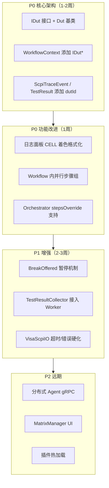

# OpenTAP vs EonTest — 全面架构对比与改善路线图

> 基于 OpenTAP 9.33.0 源码 + EonTest 全模块审计  
> 日期：2026-06-19

---

## 一、对比总表

| 维度 | OpenTAP 9.33 | EonTest (全模块审计) | 结论 |
|------|-------------|---------------------|------|
| **执行模型** | 单进程 TapThread | 多进程 Orchestrator → RuntimeWorker | ⚠️ 不同路径，各有所长 |
| **被测对象** | **DUT**（第一类 Resource） | ❌ 无 — CELL 仅是执行槽位 | ❌ EonTest 缺失 |
| **资源管理** | ResourceTaskManager（Open/Close 自动） | ResourceManager（Lease/Heartbeat/Deadlock） | ✅ EonTest **更先进** |
| **资源依赖分析** | ResourceDependencyAnalyzer + Tarjan | ResourceDependencyAnalyzer + Tarjan | ✅ **等价** |
| **SCPI 仪器** | ScpiInstrument 基类 | ScpiInstrument 基类（QObject+IResource+IStepPlugin） | ✅ **等价** |
| **SCPI IO** | 通过 Visa/Serial/TCP 后端 | SerialScpiIO / TcpScpiIO / VisaScpiIO | ✅ 但 Visa 超时/错误处理有弱项 |
| **步骤模型** | TestStep(Run+子步骤) | ActivityStep(plugin.executeStep) | ✅ 概念等价 |
| **并行** | ParallelStep → TapThread 子线程 | Orchestrator 多 CELL 进程 | ⚠️ Workflow 内无分支并行 |
| **插件系统** | ITapPlugin + ComponentSettingsList | Qt Plugin + CapabilityRegistry + semver | ✅ EonTest 能力声明更规范 |
| **日志** | LogContext + ILogListener 异步分发 | JSON Lines 事件 + EventBus | ✅ 各有所长 |
| **结果收集** | IResultListener 5 回调 | 事件总线 + TestResultCollector | ⚠️ 缺标准结果收集管道 |
| **Verdict** | NotSet<Pass<Inconclusive<Fail<Aborted<Error | **同序** + mergeVerdicts/upgradeVerdict | ✅ **完全等价** |
| **Break/Abort** | BreakOffered + TestStepBreakException | ❌ 无内置支持 | ❌ EonTest 缺失 |
| **调度策略** | 无（顺序执行） | Priority / FIFO / EDF 三种 | ✅ EonTest **更先进** |
| **矩阵/路由** | ❌ 无 | MatrixManager + RouteLease | ✅ EonTest **独有** |
| **DUT 抽象** | IDut : IResource | ❌ 无 | ❌ EonTest 缺失 |
| **配方/参数** | ComponentSettings（Bench配置） | Recipe + ParameterTemplate（数据库） | ✅ EonTest 更结构化 |
| **遥测** | 基本计数器 | Prometheus Exporter（Counter/Gauge/Histogram） | ✅ EonTest **更完善** |
| **告警** | ❌ 无 | AlertManager（规则/冷却/通知） | ✅ EonTest **独有** |
| **全链路追踪** | log events 含 source/timestamp | TraceContext（TraceId/SpanId） | ✅ EonTest **更完善** |
| **SPC** | ❌ 无 | SpcCalculator（Cp/Cpk/Pp/Ppk） | ✅ EonTest **独有** |
| **分布式** | Runner/Agent（实验性） | JobScheduler + Agent（HTTP） | ⚠️ 方向一致 |
| **Workflow 格式** | .TapPlan (XML) | .xlsx + .json | ✅ EonTest 更友好 |
| **UI** | OpenTAP Studio (WPF) | 内嵌 QML Studio + Canvas 编辑器 | ✅ EonTest 更现代 |
| **CELL 概念** | ❌ 无原生（量产区推荐多进程） | ✅ 原生 CELL + CellWorker | ✅ EonTest 量产就绪 |
| **Repo 治理** | DDD 清晰分层 | Repository 模式 + SQLite | ✅ 等价 |

---

## 二、逐项详细比对

### 2.0 执行模型对比

```
OpenTAP（单进程）：
  TestPlan.Execute()  →  DoExecute()
    ├── Open: 资源发现 → 依赖分析 → 异步并行打开
    ├── Execute: 主循环 for steps[] → step.DoRun() → Run()
    │   └── 子步骤: RunChildSteps() (顺序) 或 ParallelStep (多线程)
    └── Close: 资源关闭 → 结果通知

EonTest（多进程）：
  Orchestrator（主进程）
    ├── 加载 Workflow 列表
    ├── SchedulingPolicy::selectNext() 选择任务
    ├── 资源锁检查（heldLocks）
    ├── 分配到空闲 CELL slot
    └── fork eon-runtime-worker.exe（子进程）
        ├── WorkflowEngine.executeWorkflow()
        │   ├── PrePlanRun: preallocateResources()
        │   ├── Execute: 主循环 while currentStepId
        │   │   └── runStep → plugin->executeStep() → analyzer->analyze()
        │   └── PostPlanRun: releaseAllResources()
        └── 事件 → stdout JSON Lines → Orchestrator 收集
```

**结论**：EonTest 的多进程架构天然对齐"量产线多工位物理隔离"模式，但缺少单进程内的步骤级并行能力。

---

### 2.1 资源管理 — EonTest 意外领先

这是本次审计最意外的发现。

| 能力 | OpenTAP | EonTest |
|------|---------|---------|
| Resource 基类 | Resource : ValidatingObject | IResource（纯接口） |
| Open/Close 生命周期 | Open() + Close() | open() + close() + isConnected() |
| 生命周期管理 | ResourceTaskManager（引擎级自动） | ResourceManager（引擎级自动） |
| 租约模式 | ❌ 无 | Lease（Shared/Exclusive）+ RAII |
| 心跳/Keepalive | ❌ 无 | renewLease() + HeartbeatMonitor |
| 死锁检测 | ❌ 无 | wait-for graph + detectDeadlock() |
| 抢占策略 | ❌ 无 | None/Notify/ForcePreempt/PriorityBased |
| 批量并行预分配 | ❌ 逐资源 Open | preallocateAll() — 并行打开 |
| 依赖分析 | DependencyAnalyzer + Tarjan | DependencyAnalyzer + Tarjan |
| 多 CELL 资源隔离 | ❌ 不适用（单进程） | ✅ Orchestrator heldLocks 冲突检测 |

**EonTest 的 ResourceManager 比 OpenTAP 的 ResourceTaskManager 功能更丰富**。OpenTAP 强在"全自动"（引擎不需要显式调用），但 EonTest 的 Lease/Heartbeat/Deadlock/Preemption 是工业量产场景更需要的特性。

---

### 2.2 SCPI 仪器支持 — 整体等价，细节有差距

| 细节 | OpenTAP | EonTest |
|------|---------|---------|
| 基类 | ScpiInstrument | ScpiInstrument |
| 多继承 | Resource 单继承 | QObject + IResource + IStepPlugin 三重继承 |
| IO 后端 | 通过 ViSession | IScpiIO 接口（Serial/TCP/Visa） |
| *IDN? / *CLS | 自动 | sendIDNOnConnect / sendCLSOnConnect 可配置 |
| SYST:ERR? 自动检查 | ✅ 内置 | queryErrorAfterCommand() 可配置 |
| 线程安全 | ✅ | QMutex commandLock_ |
| Visa 超时处理 | ✅ | ⚠️ 被跳过（注释"简化跳过"） |
| Visa 错误处理 | ✅ | ⚠️ 读循环需改进 |

---

### 2.3 插件系统 — EonTest 更规范

| 特性 | OpenTAP | EonTest |
|------|---------|---------|
| 基础契约 | ITapPlugin（标记接口） | Qt Plugin IID + 3 种契约接口 |
| 类型区分 | TestStep / Instrument / DUT / ResultListener | IStepPlugin / IAnalyzerPlugin / IReporterPlugin |
| 能力声明 | ComponentSettingsList 自动属性反射 | CapabilityRegistry + semver 版本范围匹配 |
| 清单兼容性 | ❌ 无 | checkManifestCompatibility() — 版本范围 + 依赖检查 |
| 传输驱动 | ❌ 无独立接口 | IDriverPlugin + IBusDriver (11种总线) |
| DUT 支持 | IDut : IResource | ❌ 无对应接口 |

---

### 2.4 执行控制 — OpenTAP 更灵活

| 能力 | OpenTAP | EonTest |
|------|---------|---------|
| 步骤级执行 | stepsOverride（HashSet 过滤） | ❌ 全部执行 |
| 暂停 | BreakOffered 事件 | ❌ 无 |
| 中止 | TapThread.Abort() | 进程级 kill (QProcess) |
| 步骤跳转 | SuggestedNextStep (Guid) | onSuccessStepId / onFailureStepId / onSkippedStepId |
| 条件跳过 | step.Enabled | conditionKey / conditionEquals |
| 循环检测 | ❌ 无内置 | 同步骤访问 > 100 次则 fail |

**改进**：EonTest 应增加 `BreakOffered` 等价机制（步骤执行前回调），支持单步暂停/跳过。

---

### 2.5 日志与结果 — 关键缺失

| 方面 | OpenTAP | EonTest |
|------|---------|---------|
| 日志分发 | LogContext 异步 → 所有 Listener | EventBus 发布/订阅 |
| 日志持久化 | LogResultListener → Results/*.txt | scpi.trace → JSON Lines |
| 日志分层 | Source（组件标识）、Level（4 级） | source 字段（orchestrator/runtime-worker） |
| **每 CELL 日志隔离** | ❌ 不适用 | `reports/<runId>/cell-<id>/` 目录 |
| 结果收集器 | IResultListener 5 回调 | TestResultCollector + EventBus |
| 结构化结果 | ResultTable（表格化） | StepResult + TestResult (Entity) |
| 结果持久化 | LogResultListener | SqliteTestRepository + TestResultCollector |

**EonTest 当前问题**：`TestResultCollector` 已实现但未在 RuntimeWorker 中启用。Worker 输出的遥测 JSON 未统一走 `IResultCollector` 管道。

---

### 2.6 EonTest 独有优势

| 能力 | 说明 |
|------|------|
| **MatrixManager** | 交换矩阵/路由抽象，支持 batchRoute() 原子路由 |
| **SchedulingPolicy** | Priority / FIFO / EDF 三种策略，OpenTAP 无调度器 |
| **AlertManager** | 规则评估 → 冷却去重 → 回调通知，OpenTAP 无 |
| **Prometheus 遥测** | Counter/Gauge/Histogram + HTTP 端点，OpenTAP 仅基本计数 |
| **全链路追踪** | TraceContext（TraceId/SpanId），OpenTAP 无 |
| **SPC 计算** | Cp/Cpk/Pp/Ppk，OpenTAP 无 |
| **Recipe 配方** | SQLite 持久化参数模板 + 版本管理，OpenTAP 无 |
| **Canvas 编辑器** | 图形化 Workflow 编辑，OpenTAP Studio 仅树形 |
| **Semver 兼容性** | 插件清单版范围匹配 |

---

## 三、EonTest 当前不不足（按严重程度）

### P0 — 必须立即补的（影响核心功能）

#### 1. DUT 抽象缺失

**现状**：CELL 是执行槽位，不是被测对象。log.txt 中有 `cellId` 但没有 `dutId`。结果无法追溯到具体产品。

**要做**：
```
SDK/include/eon/sdk/IDut.h — 新文件
  IDut : IResource
    dutId() → QString
    serialNumber() → QString
    modelName() → QString

Runtime 改造：
  WorkflowContext 添加 IDut* dut
  ResourceManager 支持 IDut 注册与租赁
  ScpiTraceEvent 添加 dutId
  TestResult 添加 dutId 字段
```

#### 2. Workflow 内缺少步骤级并行能力

**现状**：多 CELL 并行 ✅，单 Workflow 内并行 ❌。没有 `ParallelStep` 等价物。

**要做**：Runtime 支持 parallel 步骤组（相同 parallelGroupId 的步骤可在线程内并行）。

#### 3. 日志面板看不到 CELL 信息

**现状**：日志 TextArea 显示原始 JSON，cellId 淹没其中。

**要做**：日志面板格式化解析 JSON，按 CELL 着色/分组。

---

### P1 — 应该补的（增强能力）

#### 4. Break/Pause 机制缺失

**现状**：无法暂停执行（只能杀掉进程）。

**要做**：WorkflowEngine 添加 `BreakOffered` 回调机制。

#### 5. 步骤选择执行缺失

**现状**：Run 按钮跑全部，无法选择部分步骤。

**要做**：Orchestrator 支持 `stepsOverride` 等价参数。

#### 6. 结果收集管道不完整

**现状**：`TestResultCollector` 已实现但未接入 Worker 主线。

**要做**：Worker 启用 `TestResultCollector` → 填充 TestResult → 入库。

#### 7. VisaScpiIO 超时/错误处理弱

**现状**：超时被跳过，读循环不够健壮。

**要做**：实现 `viSetAttribute(VI_ATTR_TMO_VALUE)` + 改进 readUntil 循环。

---

### P2 — 远期增强

#### 8. 分布式 Agent 硬化

`JobScheduler` 接口已定义但实际仅用 HTTP。可升级为 gRPC。

#### 9. 矩阵/路由 Manager 无 UI

`MatrixManager` 已实现，但 Studio 里无可视化拓扑图。

#### 10. 插件热加载

当前需重启才能加载新插件。

---

## 四、改善路线图



---

## 五、当前架构正确性确认

EonTest 的多进程 CELL 架构**本身是对的**——这就是 OpenTAP 描述的量产线标准方案。OpenTAP 虽然单进程灵活，但到量产场景也推荐多进程部署。

EonTest 缺的不是架构骨架，而是以下**血肉**：

1. **DUT** — 让 CELL 知道它测的是哪个产品
2. **Workflow 内并行** — 同一 CELL 内多步骤同时跑（如：一路供电一路通信）
3. **日志/结果的 CELL 归属** — 让用户一看就知道哪个 CELL 干了什么
4. **暂停/跳过** — 产线异常时的人工干预能力

这四项补齐后，EonTest 在架构上不输 OpenTAP，且拥有 OpenTAP 没有的调度策略、告警、遥测、SPC、矩阵管理等独特优势。
